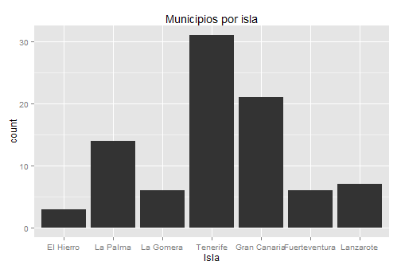

# La librería ggplot2

1. Es un paquete que permite generar gráficos estadísticos.
2. Se diferencia de otras librerías en el aspecto de controlar una gran número de componentes gráficos ("gramática de gráficos").
3. Los gráficos se pueden construir añadiéndole sucesivamente más atributos o capas ("layers").  
<br>
Libro: <cite>H.Wickham (2009). ggplot2: Elegant Graphics for Data Analysis
123, Use R!, Springer</cite>
<br>
Website: http://had.co.nz/ggplot2
<br>
Tutorial: 
http://www.ceb-institute.org/bbs/wp-content/uploads/2011/09/handout_ggplot2.pdf


    
---

# El comando qplot()

  


\begin{center}
\includegraphics[width=0.4\textwidth]{figure/plot01.png}
\end{center}


Los comandos gráficos disponibles en ggplot2 son:

* qplot() - para "quick plots" 

* ggplot() - para mejor ajuste y control de todo


---

# El comando qplot(): ejemplos

Veamos algunos ejemplos:


```r
qplot(data=data.geo.municipios,x=Superficie,main="Histograma de superficie",binwidth=50)

qplot(data=data.geo.islas,x=Superficie,y=Altitud, main="Gráfico de superficie vs. altitud")

qplot(data=data.geo.islas,x=Superficie,y=Altitud, main="Gráfico de superficie vs. altitud", 
xlab="Superficie de la isla", ylab="Altitud de la isla")

qplot(data=data.geo.islas,x=Superficie,y=Altitud, main="Gráfico de superficie vs. altitud", 
xlab="Superficie de la isla", ylab="Altitud de la isla",
xlim=c(0,2500),ylim=c(0,1500))
```


---

# Color, tamaño, forma (aspectos estéticos)

Con el comando clásico plot(), si queremos representar  variables categóricas (e.g. una variable de tipo sexo, "Hombre","Mujer") con colores, debemos realizar nosotros mismos la 
correspondencia entre categoría y color.

En qplot() se puede especificar varios argumentos: colour, size, shape 


<!--- ### la vida en color
-->

```r
qplot(data=data.geo.islas,x=Superficie,y=Altitud, colour = Isla,
main="Gráfico de superficie vs. altitud", 
xlab="Superficie", ylab="Altitud") 
```


<!--- ### el tamaño sí importa
-->

```r
qplot(data=data.geo.islas,x=Superficie,y=Altitud, size = Isla,
main="Gráfico de superficie vs. altitud", 
xlab="Superficie", ylab="Altitud") 
```


<!--- ### sin perder las formas
-->

```r
qplot(data=data.geo.islas,x=Superficie,y=Altitud, shape = Isla,
main="Gráfico de superficie vs. altitud", 
xlab="Superficie", ylab="Altitud") +
scale_shape_manual(values=1:7)
```


---

# Objetos geométricos

qplot no está limitado a gráficos de dispersión (scatterplot), 
sino que puede producir casi cualquier tipo de gráfico variando 
el argumento geom.


* geom = "point" representa puntos para producir un scatterplot. Esta es la opción por 
defecto cuando se pasan argumentos x e y a qplot().
* geom = "boxplot" produce un gráfico box-and-whisker plot de resumen de la distribución
de un conjunto de puntos.
* geom = "smooth" ajusta una curva suavizada a los datos (smoother) y su
error estándar. Esta opción se combina con un argumento method %in% c("loess","gam","lm","rlm")
(ver http://docs.ggplot2.org/0.9.3/stat_smooth.html)
* geom = "path" and geom = "line" representa lineas entre los puntos.

---

# Ejemplos de ggplot() - objetos geométricos

Vemos algunos ejemplos:


```r
qplot(data=data.geo.municipios,x=Superficie,y=Altitud, geom = "point")

qplot(data=data.geo.municipios,x=Superficie,y=Altitud, geom = "boxplot", colour = Isla)    # cuidado con el tipo de variables
qplot(data=data.geo.municipios,x=Isla,y=Altitud, geom = "boxplot")

qplot(data=data.geo.municipios,x=Superficie,y=Altitud, geom = "smooth", method="loess")
qplot(data=data.geo.municipios,x=Superficie,y=Altitud, geom = c("point", "smooth"), method="lm")

qplot(data=data.geo.municipios,x=Superficie,y=Altitud, geom = "path")
qplot(data=data.geo.municipios,x=Superficie,y=Altitud, geom = "line")

qplot(data=data.geo.municipios, x=Provincia, geom = "bar")
qplot(data=data.geo.municipios, x=Superficie, geom = "histogram")
qplot(data=data.geo.municipios, x=Superficie, geom = "density")
```


---

# Comprensión de la gramática de capas

1. Podemos usar sólo qplot() pero la verdadera potencia de ggplot2 está en el manejo de 
los gráficos por capas (gramática de capas) mediante ggplot(). 

2. El qplot recorta bastantes detalles de ggplot() a pesar que permite una sintaxis 
más familiar y cercana al plot().

3. Con ggplot(), sin embargo, es posible incorporar a un gráfico     diferentes niveles de detalle
mediante sucesivas capas (layers). 

```r
ggplot(data, mapping) +
layer( 
      geom = "",  
      stat = "",  
      position = "", ....  
      )
```


---


# Otros objetos geométricos en ggplot2

Name | Description  
------------- | -------------
abline | Line, specified by slope and intercept 
area | Area plots  
bar | Bars, rectangles with bases on y-axis  
boxplot | Box-and-whisker plot  
contour | Display contours of a 3d surface in 2d  
errorbar | Error bars  
histogram | Histogram  
line | Connect observations, in order of x value  
point | Points, as for a scatterplot  
polygon | Polygon, a filled path  
step | Connect observations by stairs  
text | Textual annotations  


---

# Algunas transformaciones estadísticas en ggplot2

Name | Description  
------------- | -------------
bin | Bin data
boxplot | Calculate components of box-and-whisker plot
contour | Contours of 3d data
density | Density estimation
function | Superimpose a function
identity | Don't transform data
quantile | Continuous quantiles
smooth | Add a smoother
step | Create stair steps
sum | Sum unique values. Useful for overplotting on scatterplots
summary | Summarise y values at every unique x
unique | Remove duplicates  

---

# Scatterplot en ggplot2

Un scatterplot:


```r
ejemplo1<-qplot(data=data.geo.municipios,x=Superficie,y=Altitud, colour = Isla)
```

se compone de (http://docs.ggplot2.org/current/index.html): 

* Un conjunto de datos por defecto (data).

* Una asignación de variables del conjunto de datos a atributos gráficos (aesthetics). 

```r
ejemplo1<-ggplot(data=data.geo.municipios, mapping=aes(x=Superficie,y=Altitud, colour=Isla))
```


--- 

# Scatterplot en ggplot2: layers

Y de las siguientes capas o layers:

* El tipo de objeto geométrico (punto, línea, barra, ...) utilizado para la representación (geom). 


```r
  ejemplo1 + layer(geom="point")  # o tambien: ejemplo1 + geom_point() 
```


* Una transformación estadística (suma, densidad, boxplot,..) de los datos (stat).


```r
  ejemplo1 + layer(geom="point", stat="identity" ) # o tambien: ejemplo1 + geom_point(stat="identity")  
# o tambien: ejemplo1 + geom_point()  
```


\begin{center}
\includegraphics[width=0.4\textwidth]{figure/unnamed-chunk-6.png}
\end{center}

---

# Scatterplot en ggplot2: otros aspectos

Además, se puede

* Controlar cómo se asignan las variables del conjunto de datos a los atributos aesthetics (scales). 
Por ejemplo, la forma (shape) o el tamaño (size) de los objetos puede cambiar según el valor de las variables. 


```r
  ejemplo1<-ggplot(data=data.geo.municipios, mapping=aes(x=Superficie,y=Altitud, colour=Isla))

  ejemplo1 + geom_point(mapping=aes(shape=Provincia) ) + scale_shape(solid = FALSE)  # cambiar la forma
  
  ejemplo1 + geom_point(mapping=aes(size=Provincia) ) + scale_size_discrete(range = c(2, 4) ) # cambiar el tamaño
```


* Cambiar el sistema de representación de coordenadas (coord)


```r
  ejemplo1 + geom_point() + coord_polar()
```

* Especificar la visualización de subconjuntos de los datos en diferentes paneles (facet)


```r
  ejemplo1 + geom_point() + facet_grid(. ~ Provincia)
```


---

# Gráfico de barras en ggplot2

Un diagrama de barras:


```r
ejemplo2<-qplot(data=data.geo.municipios,x=Provincia, geom = "bar", fill = Isla)
```


* La asignación o mapping de variables (atributos aesthetics):


```r
  ejemplo2<-ggplot(data=data.geo.municipios, mapping=aes(x=Provincia, fill=Isla))
```


* El tipo de objeto geom: 


```r
  ejemplo2 + layer(geom="bar")    # o tambien: ejemplo2 + geom_bar()  
```


---

# Gráfico de barras en ggplot2: layers

* La transformación estadística stat:


```r
  ejemplo2 + layer(geom="bar", stat="bin" )  
  # o tambien:  ejemplo2 + geom_bar(stat="bin")  
  # o tambien: ejemplo2 + geom_bar()
```

* El ajuste de posición en el gráfico (position):  


```r
  ejemplo2 + layer(geom="bar", stat="bin", position="dodge")  
  # o tambien:  ejemplo2 + geom_bar(position=position_dodge() )   
```


---

# Otros gráficos en ggplot2

Algunos ejemplos mas (densidad e histograma):


```r
qplot(data=data.espacios.nat, x=Superficie, geom = "density", colour = Isla)   
# las densidades son superpuestas
 
ggplot(data=data.espacios.nat, mapping=aes(x=Superficie,colour=Isla)) +geom_density()
```


```r
qplot(data=data.espacios.nat, x=Superficie, geom = "histogram", colour = Isla) 
# los histogramas son apilados y se colorea el borde

ggplot(data=data.espacios.nat, mapping=aes(x=Superficie,colour=Isla)) +geom_histogram()
```


```r
qplot(data=data.espacios.nat, x=Superficie, geom = "histogram", fill = Isla)   
# los histogramas son apilados y se colorea el interior

ggplot(data=data.espacios.nat, mapping=aes(x=Superficie,fill=Isla)) +geom_histogram()
```


---

# Otros gráficos en ggplot2

Algunos ejemplos mas (gráficos de barras):


```r
qplot(data=data.espacios.nat, x=Espacio.natural, geom = "bar", fill = Isla) 
# también los gráficos de barras son apilados

ggplot(data=data.espacios.nat, mapping=aes(x=Espacio.natural,fill=Isla)) +geom_bar(position=position_dodge() )

```

```r
qplot(data=data.espacios.nat, x=Espacio.natural, geom = "bar", fill = Isla, position="dodge") 
# barras colocadas unas al lado de otras

ggplot(data=data.espacios.nat, mapping=aes(x=Espacio.natural,fill=Isla)) +geom_bar()
```


---

# Otros gráficos en ggplot2

Algunos ejemplos mas:


```r
qplot(data=data.geo.municipios, x=Provincia, geom = "bar")

ggplot(data=data.geo.municipios, mapping=aes(x=Provincia)) +geom_bar()
```


```r
qplot(data=data.geo.municipios, x=Provincia, geom = "bar", fill = Isla)

ggplot(data=data.geo.municipios, mapping=aes(x=Provincia,fill = Isla)) +geom_bar()
```


---

# Otros gráficos en ggplot2

Algunos ejemplos mas:


```r
qplot(data=data.geo.municipios, x=Superficie, geom = "histogram")

ggplot(data=data.geo.municipios, mapping=aes(x=Superficie) +geom_histogram()

qplot(data=data.geo.municipios, x=Superficie, geom = "density")

ggplot(data=data.geo.municipios, mapping=aes(x=Superficie) +geom_density()
       
qplot(data=data.geo.municipios, x=Superficie, geom = "density", colour = Provincia)   # las densidades son superpuestas

ggplot(data=data.geo.municipios, mapping=aes(x=Superficie, colour = Provincia)) +geom_density()
```


---

# Otros gráficos en ggplot2

Algunos ejemplos mas:


```r
qplot(data=data.geo.municipios, x=Superficie, geom = "histogram", colour = Provincia)  
# los histogramas son apilados y se colorea el borde
       
       
qplot(data=data.geo.municipios, x=Superficie, geom = "histogram", fill = Provincia)  
# los histogramas son apilados y se colorea el interior

qplot(data=data.geo.municipios, x=Superficie, geom = "histogram", fill = Provincia, position="dodge")  
# las barras se pueden representar sin apilar
       
```


