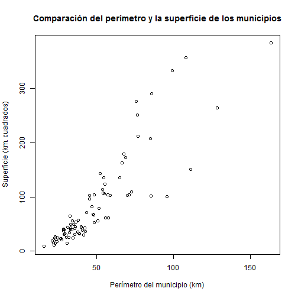
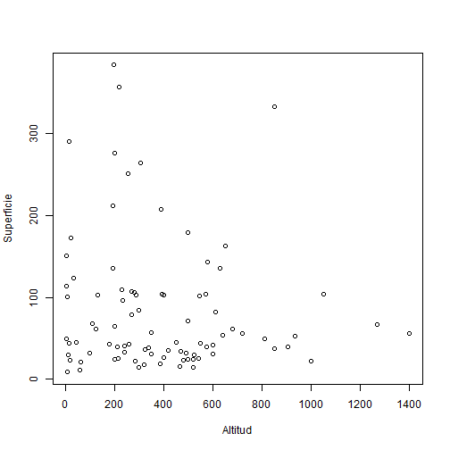
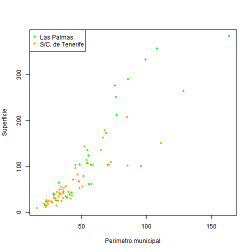
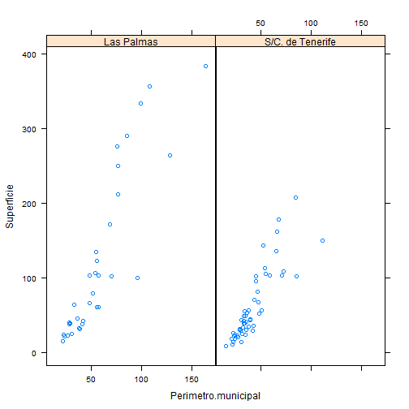

# Introducción al entorno de R

R es un lenguaje de alto nivel y un entorno para la manipulación de datos, cálculo y gráficos.

1. Almacenamiento y manipulación efectiva de datos
2. Operadores para cálculo sobre variables indexadas y matrices
3. Amplia, coherente e integrada colección de herramientas para análisis de
datos
4. Grandes posibilidades gráficas
5. Lenguaje de programación orientado a objetos bien desarrollado, simple y efectivo
6. Lenguaje interpretado, no compilado. Posibilidad de usar scripts
7. Es de código abierto: se distribuye bajo la GPL (General Public License), que no impone ninguna restricción al uso de R (tanto académico como comercial). 
<br>
Website: http://www.r-project.org/
<br>


---

# ¿Por qué R?

* Para alumnos:
 1. Dispone de las herramientas clásicas de la estadistica
 2. Es multiplataforma y gratis
 3. Ofertas de trabajo

* Para investigadores:
 1. Desarrollos estadísticos avanzados
 2. Proliferación de código R en muchos trabajos científicos

* Para universidades:
 1. Ahorro de licencias campus de software propietario (SPSS)
 2. Implica menos problemas de soporte técnico

---

# Ventajas de R

1. Posibilidad de combinar análisis "empaquetados" en librerías con desarrollos propios "ad-hoc"
2. Gráficos de alta calidad exportables a distintos formatos
3. Consume pocos recursos informáticos
4. Puede ejecutarse remotamente y conectarse con otros programa (llamar a librerías de R desde PROC IML)

# Desventajas de R

1. Interfaz gráfica limitada (aunque se dispone de varios GUI que suplen esta deficiencia desde el punto de vista docente)

2. No hay soporte comercial 

3. El lenguaje de comandos es un lenguaje de programación


---

# Estructura de un sistema R

R consta de un sistema base (instalación primaria) pero se pueden extender las funcionalidades mediante librerías o paquetes (se instalan bajo demanda). Algunos de estos paquetes son:

mva: Classical multivariate analysis

maptools: Herramientas para el manejo de objetos geoespaciales

googleVis: Librería que sirve de interfaz entre R y Google chart tools

....


---

# Sesión de R


Se puede iniciar una sesión de R en modo terminal (en sistemas Linux) o empleando un R GUI (en sistemas windows). 

La interfaz de R para windows proporciona un menú muy básico para gestionar algunos aspectos de sesión de R:

> 1. El histórico de comandos (.Rhistory)
> 2. El espacio de trabajo de la sesión (.RData)
> 3. La instalación de librerías desde un repositorio CRAN


---

# Uso básico de R

Desde R se pueden realizar sencillas operaciones aritméticas

<style>
pre {
  margin-bottom: -10px;
}
</style>


```r
(4 - 3) * 2/3
sqrt(9)
sin(pi/2)
factorial(3)
```


---

# Uso básico de R

R ejecuta ciertas operaciones que, en otros programas, podrían generar mensajes de error


```r
1/0
0/0
log(-1)
sqrt(-9)
```


---

# Almacenar resultados en variables. El espacio de trabajo

El operador de asignación (<-) permite almacenar valores:

```r
a <- log(10)
a <- log(10)
a = log(10)  #¿cual usar: = o <-?
a <- rnorm(4, mean = 10, sd = 1)  # en R se utiliza = para asignar valores a los argumentos de las funciones
```


Al introducir los comandos anteriores, hemos creado un objeto en R: la variable "a". Este objeto se almacena en una zona de memoria llamada "espacio de trabajo".

```r
ls()
```


---

# La ayuda en R

Para invocar la ayuda en R, podemos hacerlo de la forma siguiente


```r
help(rnorm)
`?`(rnorm)
help.search("pc-axis")
help.start()
```


---

# Vectores en R

Crear secuencias de vectores


```r
x <- c(1, 2, 3, 4, 5)
y <- c(1:5)
`?`(seq)
# los argumentos con = significa que hay que escribir el nombre los
# argumentos sin = significa que hay que ponerlos en el mismo orden
z <- seq(1, 10, by = 2)
w <- rep(1:5, times = 2)
w <- rep(1:5, each = 3)
```


Operaciones con vectores


```r
2 * x
x + z
x * z
# se pueden sumar vectores de distinta longitud pero se produce un efecto
# cíclico
x + w

```


---

# Vectores como argumentos de funciones en R

Algunas funciones se evalúan sobre un vector y
devuelven otro vector de la misma longitud. Otras, en cambio, devuelven un escalar


```r
log(x)
sum(x)
range(x)
length(x)
```


Incluso al evaluar una condición sobre un vector se obtiene un vector


```r
x < 3
x < 3 | z > 5
x < 3 & z < 5
```


---

# Elementos de un vector

Para seleccionar elementos de un vector se utiliza la notación de []:


```r
x <- c(1, 2, 3, 4, 5)
x[3]  # elementos de un vector
x[c(1:2)]  # partes de un vector
x[1:2]  # partes de un vector
x[-1]  # quitar partes de un vector
# ¿Cómo seleccionar los elementos de x menores que 2?
```


se pueden modificar los vectores haciendo uso del operador asignación:

```r
x[1:2] <- c(12, 13)
x[1:2] <- 0
x[15] <- 0
```


---

# Tipo de los elementos de un vector

Los vectores en R son objetos con todos sus elementos del mismo tipo

```r
x <- c(1, 2, 3, 4, 5)
class(x)
x <- c(1, 2, "hola")
class(x)
```


Se pueden asignar nombres a cada componente de un vector

```r
x <- c(1, 2, 3, 4, 5)
names(x) <- c("primero", "segundo", "tercero", "cuarto", "quinto")
attributes(x)
x[2]  # accede al elemento nº2
x["segundo"]
x[segundo]
```


Hay funciones que podemos utilizar para verificar si un objeto es o no un vector

```r
is.vector(x)
```


---

# Factores en R

Los factores son vectores que alamcenan datos categóricos (variable con varios niveles)

```r
x <- c("Juan", "Paco", "María", "Arturo")
s <- c("hombre", "hombre", "mujer", "hombre")
s <- factor(s)

attributes(s)
is.factor(s)
```


---

# Matrices en R

Las matrices se crean en R utilizando matrix() (bidimensionales) o array() (más de 2 dimensiones) 

```r
m <- matrix(1:6, nrow = 3, ncol = 2)
m[1, ]
m[, 2]

attributes(m)
dimnames(m) <- list(c("A", "B", "C"), c("1", "2"))
attributes(m)
is.matrix(m)

m["A", ]
m[, "2"]
```


---

# Listas en R

Las listas en R son colecciones ordenadas de objetos

```r
l <- list(padres = c("Juan", "María"), num.hijos = 2, edad.hijos = c(3, 7))
# observar que se emplea = para asignar los nombres a los objetos y no el
# operador <-
attributes(l)
names(l)
is.list(l)
l[[1]]  # accede al objeto nº1
l[["padres"]]  # accede al objeto 'padres'
l$padres  # accede al objeto 'padres'
l$padres <- c("Juan Pérez", "María González")
l$padres[2]
```


---

# Hojas de datos en R

Las hojas de datos en R son matrices de datos formadas por elementos (columnas) de igual longitud (filas). En general, cada columna representa una variable y cada fila una observación.

```r
id <- c(1:6)
sexo <- rep(c("HOMBRE", "MUJER"), each = 3)
edad <- sample(20:60, size = 6, replace = TRUE)
d <- data.frame(id = id, sexo = sexo, edad = edad)

attributes(d)
names(d)
d[[2]]
d[["sexo"]]
d$sexo
class(d$sexo)
```


---

# Paquetes en R

> 1. La gran potencia que proporciona R reside en la gran cantidad de paquetes desarrollados y que se encuentran en repositorios CRAN. 
> 2. En la instalación base de R se instalan sólo algunos de ellos. 
> 3. A medida que se necesitan nuevas funcionalidades, se pueden instalar fácilmente 


```r
library()  # listar todos los paquetes disponibles en R
install.packages("RJSONIO")
install.packages("ggplot", dependencies = TRUE)
library(RJSONIO)  # cargar el paquete

```


---

# El directorio de trabajo. La carga de datos 

Cuando se inicia R, el programa configura por defecto un directorio desde donde se leen o donde se guardan ficheros. Los comandos getwd() y setwd() permiten consultar y cambiar el directorio de trabajo. 


```r
getwd()
setwd("C:\\RLibraries")
```


Si queremos cargar un conjunto de datos desde un archivo situado en el directorio de trabajo, lo podemos hacer mediante el comando read.table() 


```r
# cargar los datos utilizando read.table (en local)
setwd("C:\\RLibraries")
data.espacios.nat <- read.table(file = "superficie_espacios_naturales.txt", 
    header = T, sep = ";")
data.geo.municipios <- read.table(file = "datos_geograficos_islas.txt", header = T, 
    sep = ";")
```


---

# Otros métodos para la carga de datos

Se puede utilizar read.table() para cargar datos desde un lugar remoto:


```r
# cargar los datos utilizando la función url() (en remoto, por http://)
data.url <- "http://dl.dropbox.com/u/17677514/datos_geograficos_islas.txt"
data.geo.municipios <- read.table(file = url(data.url), header = T, sep = ";")
```


```r
# cargar los datos utilizando la función url() (en remoto, por https://)
data.url <- "https://raw.github.com/cpgonzal/cursoR/gh-pages/data/datos_geograficos_islas.txt"
library(RCurl)
data.geo.municipios <- read.table(textConnection(getURL(data.url, ssl.verifypeer = FALSE)), 
    header = T, sep = ";")
```


---

# Otros métodos para la carga de datos

Podemos completar los data.frames con más variables:


```r
# crear factores con etiquetas
data.geo.municipios$Isla <- factor(data.geo.municipios$Isla, levels = c("El Hierro", 
    "La Palma", "La Gomera", "Tenerife", "Gran Canaria", "Fuerteventura", "Lanzarote"))

data.geo.municipios$Provincia <- c(rep("Las Palmas", 34), rep("S/C. de Tenerife", 
    54))
```

También podemos crear data.frames con información resumida:


```r
# resumir datos from data frames
data.geo.islas <- aggregate(data.geo.municipios[, c(3, 5)], by = list(Provincia = data.geo.municipios$Provincia, 
    Isla = data.geo.municipios$Isla), FUN = sum, na.rm = T)

data.geo.islas$Altitud <- aggregate(data.geo.municipios[, 6], by = list(Provincia = data.geo.municipios$Provincia, 
    Isla = data.geo.municipios$Isla), FUN = max, na.rm = T)[, 3]

# estructura de los datos
str(data.geo.islas)
```

```
## 'data.frame':	7 obs. of  5 variables:
##  $ Provincia     : chr  "S/C. de Tenerife" "S/C. de Tenerife" "S/C. de Tenerife" "S/C. de Tenerife" ...
##  $ Isla          : Factor w/ 7 levels "El Hierro","La Palma",..: 1 2 3 4 5 6 7
##  $ Superficie    : num  269 708 370 2034 1560 ...
##  $ Longitud.costa: num  41 155.6 97.5 358 242.9 ...
##  $ Altitud       : int  571 722 810 1400 1270 395 305
```


---

# Otros métodos para la carga de datos

Para cargar datos en formato JSON:


```r
# read en JSON format
library(RJSONIO)
data.url <- "http://www.gobiernodecanarias.org/istac/jaxi-istac/tabla.do?accion=jsonMtd&uuidConsulta=7db99ff7-4aab-4a57-a378-fc472aecaeb6"
data.json <- paste(readLines(data.url, encoding = "UTF-8")[1], collapse = "")
```

```
## Warning: incomplete final line found on
## 'http://www.gobiernodecanarias.org/istac/jaxi-istac/tabla.do?accion=jsonMtd&uuidConsulta=7db99ff7-4aab-4a57-a378-fc472aecaeb6'
```

```r
data.json <- fromJSON(data.json, encoding = "UTF-8")
```


---

# Otros métodos para la carga de datos

Para consultar la estructura que se ha cargado:


```r
# consultar la estructura que se ha cargado
attributes(data.json)
data.json$categories
length(data.json$data)
head(data.json$data)

data.json$data[[1]]
data.json$data[[1]]$dimCodes[1]
```


---

# Otros métodos para la carga de datos

Si tenemos problemas en la carga de datos desde el servicio web, lo podemos hacer de otra forma:


```r
data.url <- "http://dl.dropboxusercontent.com/u/17677514/datos_poblacion_municipios.json"
data.json <- paste(readLines(data.url, encoding = "UTF-8")[1], collapse = "")
```

```
## Warning: incomplete final line found on
## 'http://dl.dropboxusercontent.com/u/17677514/datos_poblacion_municipios.json'
```

```r
data.json <- fromJSON(data.json, encoding = "UTF-8")
```


---

# El arreglo de los datos cargados en formato JSON


```r
# pasamos los datos a una estructura temporal manejable
tmp.json <- do.call(rbind, data.json$data)
tmp.json.valores <- unlist(tmp.json[, 1])
tmp.json.cod <- tmp.json[, 2]

# creamos un data.frame para trabajar los datos
data.from.json <- data.frame(matrix(ncol = 4, nrow = 4992))
names(data.from.json) <- c("CodMunicipio", "CodAnio", "CodIndicador", "Valor")

for (i in 1:4992) {
    data.from.json$CodMunicipio[i] <- tmp.json.cod[[i]][1]
    data.from.json$CodAnio[i] <- tmp.json.cod[[i]][2]
    data.from.json$CodIndicador[i] <- tmp.json.cod[[i]][3]
    data.from.json$Valor[i] <- as.numeric(tmp.json.valores[[i]])
}

rm(tmp.json, tmp.json.valores, tmp.json.cod)
```


---

# El arreglo de los datos cargados en formato JSON


```r
# asociamos los códigos a sus valores descriptivos
idx <- match(data.from.json$CodMunicipio, data.json$categories[[1]]$codes)
data.from.json$Municipio <- data.json$categories[[1]]$labels[idx]

idx <- match(data.from.json$CodAnio, data.json$categories[[2]]$codes)
data.from.json$Anio <- data.json$categories[[2]]$labels[idx]

idx <- match(data.from.json$CodIndicador, data.json$categories[[3]]$codes)
data.from.json$Indicador <- data.json$categories[[3]]$labels[idx]

# reordenamos convenientemente las variables
data.pob.municipios <- data.from.json[, c(1, 5, 2, 6, 3, 7, 4)]
```


---

# Otros métodos para la carga de datos

Para cargar datos en formato PC-AXIS:


```r
library(pxR)
data.url <- "http://www.gobiernodecanarias.org/istac/jaxi-istac/descarga.do?uripx=urn:uuid:d73bd9de-e6ed-4821-808a-616b34df9655"

data.px <- read.px(data.url)

head(data.px)
data.px$VALUES
data.px$CODES

data.from.px <- as.data.frame(data.px)
names(data.from.px) <- c("Indicadores", "Años", "Municipios", "Valor")

```


---


# Funciones gráficas en R


```r
plot(data.geo.municipios$Superficie, data.geo.municipios$Perímetro.municipal)

plot(Superficie ~ Perímetro.municipal, data = data.geo.municipios)

plot(Superficie ~ 1, data = data.geo.municipios, type = "h")
plot(Superficie ~ 1, data = data.geo.municipios, type = "s")

plot(Superficie ~ Perímetro.municipal, data = data.geo.municipios, xlab = "Perímetro del municipio (km)", 
    ylab = "Superficie (km. cuadrados)", main = "Comparación del perímetro y la superficie de los municipios")
```





---

# El comando par() 


```r
# plot(1:25,1:25,pch=1:25)
par.plot <- par(pch = 20, col = "blue", mfrow = c(2, 1))
plot(Superficie ~ Perímetro.municipal, data = data.geo.municipios)
plot(Superficie ~ Altitud, data = data.geo.municipios)
```





---

# Coloreado por grupos


```r
data.geo.municipios$Provincia <- as.factor(data.geo.municipios$Provincia)
plot.colors <- c("green", "orange")

plot(Superficie ~ Perímetro.municipal, data = data.geo.municipios, col = plot.colors[data.geo.municipios$Provincia], 
    pch = 20)
legend("topleft", legend = levels(data.geo.municipios$Provincia), col = c("green", 
    "orange"), pch = rep(20, 2))
```




---

# Funciones gráficas avanzadas: paquete lattice() 

Podemos conseguir un cierto grado de personalización en los gráficos en R. Los gráficos de panel (trellis graphics) permiten representar visualizaciones por grupos: 


```r
library(lattice)

histogram(~Superficie | Provincia, data = data.geo.municipios)

densityplot(~Superficie | Provincia, data = data.geo.municipios)

bwplot(Superficie ~ Provincia, data = data.geo.municipios)

xyplot(Superficie ~ Perímetro.municipal | Provincia, data = data.geo.municipios)
```





---


# Programación de funciones en R

Es posible programar funciones personalizadas en R:


```r
myfunction <- function(x) {
    resumen <- summary(x)
    return(resumen)
}

myfunction(data.pob.municipios)
```


El EUSTAT tiene algunos ejemplos de programaciones sencillas con R:

http://www.eustat.es/documentos/datos/CT_Visualizacion_de_datos_en_las_Estadisticas_Oficiales_c.pdf

---

# Programación de funciones en R

Veamos otro ejemplo de función:


```r
mystats <- function(x) {
    myinput <- x
    mymean <- mean(x, na.rm = TRUE)
    mysd <- sd(x, na.rm = TRUE)
    return(list(data = myinput, media = mymean, desv.tipica = mysd))
}

mystats(data.pob.municipios[data.pob.municipios$CodMunicipio %in% c(38013, 38048, 
    38901) & data.pob.municipios$Indicador == "Cifras absolutas" & data.pob.municipios$Anio == 
    "2012", "Valor"])
```


---

# Programación de funciones en R

Otro ejemplo de función:


```r
myfactorial <- function(n) {
    myresult <- 1
    if (n >= 0) 
        for (i in 1:n) myresult <- myresult * i else stop("Sólo funciona para valores positivos")
    end
    return(myresult)
}

myfactorial(5)
```

