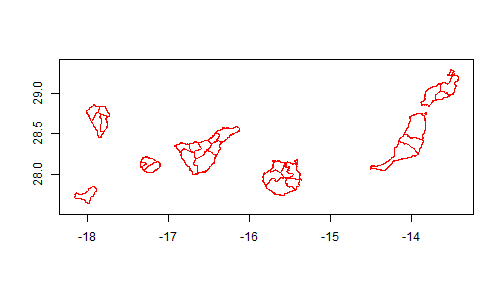
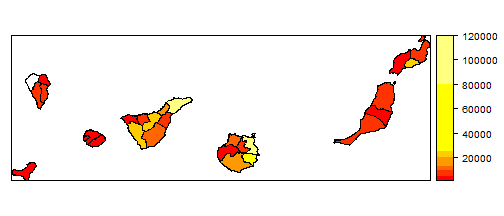
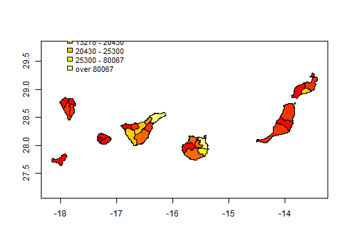
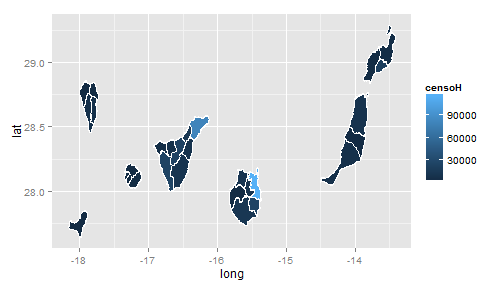
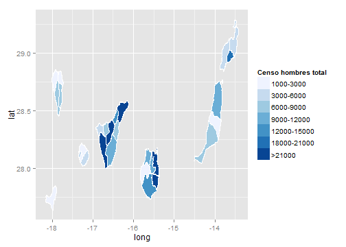
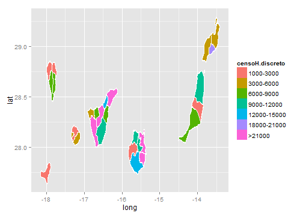

## La librería maptools

Cargamos los archivos de las 27 comarcas de canarias:


```r
library(maptools)
canary.counties <- readShapeLines(fn = "ISTAC_comarcas27_R.shp")
plot(canary.counties, axes = TRUE, col = "red")
```


 


---

## La librería maptools

Vamos a cargar el mapa en forma de polígonos (Poly Shape):


```r
canary.counties <- readShapePoly(fn = "ISTAC_comarcas27_R.shp")
plot(canary.counties, axes = TRUE, col = "red")
```


 


---

## La librería maptools

Para examinar el objeto canary.counties que hemos cargado:


```r
canary.counties
summary(canary.counties)

slotNames(canary.counties)
canary.counties@data
canary.counties@polygons[[1]]
```


Observamos que los ejes representados no corresponden a las escalas de latitud y longitud de un mapa:


```r
print(proj4string(canary.counties))
proj4string(canary.counties) <- "+proj=longlat +datum=WGS84"
print(proj4string(canary.counties))
plot(canary.counties, axes = TRUE)
```


---

## La librería maptools

Para representar una variable en un mapa, lo más común es asociar al slot "data" los valores de la variable utilizando el comando merge(). Por ejemplo:


```r
censal.hombres <- data.comarcas.censal[data.comarcas.censal$sexo == "men", ]
canary.tmp <- merge(canary.counties@data, censal.hombres, by.x = "CODCOM", by.y = "comarca", 
    sort = FALSE)
canary.counties@data$sexoH <- canary.tmp$sexo
canary.counties@data$censoH <- canary.tmp$censo
```


Tambien se puede utilizar el comando match(). Por ejemplo:

```r
censal.mujeres <- data.comarcas.censal[data.comarcas.censal$sexo == "women", 
    ]
idx <- match(canary.counties@data$CODCOM, censal.mujeres$comarca)
canary.counties@data$sexoM <- censal.mujeres$sexo[idx]
canary.counties@data$censoM <- censal.mujeres$censo[idx]
```


---

## La librería maptools

Para representar un mapa de intensidad, necesitamos definir una paleta de colores y luego el comando spplot();


```r
library(classInt)
library(RColorBrewer)
n = 7
# obtener una paleta de 7 colores
pal <- brewer.pal(n, "Blues")
# obtener intervalos de clase para 7 colores
int <- classIntervals(canary.counties@data$censoH, n, style = "jenks")

p <- spplot(canary.counties["censoH"], col.regions = pal, at = signif(int$brks, 
    digits = 2), lwd = 0.4, col = "black")
p
```

 


---

## La librería maptools

La comarca con menor valor del censo se puede quedar de color blanco: 


```r
# corrección del primer color de la escala
int$brks[1] <- 1000
# comprobar el orden de representación
canary.counties@data[order(canary.counties@data$censoH), ]
```


Podemos utilizar otras paletas:


```r
# Paletas

# display.brewer.pal(n, 'Blues')
pie(rep(1, n), col = brewer.pal(n, "Blues"))
pie(rep(1, n), col = brewer.pal(n, "YlOrRd"))
pie(rep(1, n), col = heat.colors(n))
pie(rep(1, n), col = terrain.colors(n))
```


---

## La librería maptools


```r
pal <- heat.colors(n)
p <- spplot(canary.counties["censoH"], col.regions = pal, at = signif(int$brks, 
    digits = 2), lwd = 0.4, col = "black")
p
```

 


---

## La librería maptools

Se pueden utilizar otros métodos para los intervalos de clase:


```r
# Intervalos de clase
int <- classIntervals(canary.counties@data$censoH, n, style = "quantile")
int <- classIntervals(canary.counties@data$censoH, n, style = "pretty")
int <- classIntervals(canary.counties@data$censoH, n, style = "jenks")
```


---

## La librería maptools

Podemos utilizar otros métodos de representación, plot() + legend():


```r
# Representaciones alternativas
plot(canary.counties, col = pal[findInterval(canary.counties@data$censoH, int$brks, 
    all.inside = TRUE)], axes = TRUE)
legend(x = -18, y = 30.5, legend = leglabs(round(int$brks)), cex = 0.9, fill = pal, 
    bty = "n", x.intersp = 0.5)
```

 


---

## La librería maptools

Otros métodos de representación, fortify()+ggplot2():
 

```r
# Otra mas
library(ggplot2)

# convertir el objeto 'SpatialPolygons' en data.frame
canary.fort <- fortify(canary.counties, region = "IDCOM27")
head(canary.fort)

canary.fort <- merge(canary.fort, canary.counties@data[, c("IDCOM27", "censoH")], 
    by.x = "id", by.y = "IDCOM27", sort = FALSE)

ggplot(data = canary.fort, aes(long, lat, group = group)) + geom_polygon(colour = "black", 
    fill = "white")
```


---

## La librería maptools

Entonces:


 

```r
map <- ggplot(data = canary.fort, aes(long, lat, group = group, fill = censoH)) + 
    geom_polygon() + geom_path(color = "white")
map
```

 


---

## La librería maptools

Otras variantes con ggplot2():


```r
map + scale_fill_gradient(low = "white", high = "black")

map + scale_fill_gradient(name = "censo", breaks = c(10000, 50000, 90000))

map + scale_fill_gradientn(colours = brewer.pal(7, "Blues"), limits = c(1000, 
    1e+05))
```


---

## La librería maptools

Podemos utilizar escalas discretas en el gráfico:


```r
canary.fort$censoH.discreto <- cut(canary.fort$censoH, breaks = c(1000, 3000, 
    6000, 9000, 12000, 15000, 18000, 21000, Inf), labels = c("1000-3000", "3000-6000", 
    "6000-9000", "9000-12000", "12000-15000", "15000-18000", "18000-21000", 
    ">21000"), include.lowest = TRUE)

head(canary.fort)
```


---

## La librería maptools

Entonces:


```r
map <- ggplot(data = canary.fort, aes(long, lat, group = group, fill = censoH.discreto)) + 
    geom_polygon() + geom_path(color = "white")

map + scale_fill_brewer("Censo hombres total")
```

 

```r
map
```

 


---

## La librería maptools


---

## La librería ggplot2

> 1. Es un paquete que permite generar gráficos estadísticos.
> 2. Se diferencia de otras librerías en el aspecto de controlar una gran número de componentes gráficos ("gramática de gráficos").
> 3. Los gráficos se pueden construir añadiéndole sucesivamente más atributos o capas ("layers").  
<br>
Libro: <cite>H.Wickham (2009). ggplot2: Elegant Graphics for Data Analysis
123, Use R!, Springer</cite>
<br>
Website: http://had.co.nz/ggplot2
<br>
Tutorial: 
http://www.ceb-institute.org/bbs/wp-content/uploads/2011/09/handout_ggplot2.pdf


--- &twocol w1:50% w2:50%

## Introducción a la librería ggplot2   
    
*** =left


```r
#cargar la librería 
library(ggplot2)
#un gráfico sencillo
qplot(data=data.geo.municipios, x=Isla,   
      main="Municipios por isla")
```

 


*** =right

Los comandos gráficos disponibles en ggplot2 son:
* qplot() - para "quick plots" 
* ggplot() - para mejor ajuste y control de todo


---

## Introducción a la librería ggplot2

Veamos algunos ejemplos:


```r
qplot(data=data.geo.municipios,x=Superficie,main="Histograma de superficie",binwidth=50)

qplot(data=data.geo.islas,x=Superficie,y=Altitud, main="Gráfico de superficie vs. altitud")

qplot(data=data.geo.islas,x=Superficie,y=Altitud, main="Gráfico de superficie vs. altitud", 
xlab="Superficie de la isla", ylab="Altitud de la isla")

qplot(data=data.geo.islas,x=Superficie,y=Altitud, main="Gráfico de superficie vs. altitud", 
xlab="Superficie de la isla", ylab="Altitud de la isla",
xlim=c(0,2500),ylim=c(0,1500))
```


--- &twocol w1:45% w2:50%

## Introducción a la librería ggplot2   
    
*** =left

### Color, tamaño, forma (aspectos estéticos)

Con el comando clásico plot(), si queremos representar  variables categóricas (e.g. una variable de tipo sexo, "Hombre","Mujer") con colores, debemos realizar nosotros mismos la 
correspondencia entre categoría y color.

En qplot() se puede especificar varios argumentos: colour, size, shape 


*** =right

<!--- #### la vida en color
-->

```r
qplot(data=data.geo.islas,x=Superficie,y=Altitud, colour = Isla,
main="Gráfico de superficie vs. altitud", 
xlab="Superficie", ylab="Altitud") 
```


<!--- #### el tamaño sí importa
-->

```r
qplot(data=data.geo.islas,x=Superficie,y=Altitud, size = Isla,
main="Gráfico de superficie vs. altitud", 
xlab="Superficie", ylab="Altitud") 
```


<!--- #### sin perder las formas
-->

```r
qplot(data=data.geo.islas,x=Superficie,y=Altitud, shape = Isla,
main="Gráfico de superficie vs. altitud", 
xlab="Superficie", ylab="Altitud") +
scale_shape_manual(values=1:7)
```


---

## Introducción a la librería ggplot2

### Objetos geométricos

qplot no está limitado a gráficos de dispersión (scatterplot), 
sino que puede producir casi cualquier tipo de gráfico variando 
el argumento geom.


* geom = "point" representa puntos para producir un scatterplot. Esta es la opción por 
defecto cuando se pasan argumentos x e y a qplot().
* geom = "boxplot" produce un gráfico box-and-whisker plot de resumen de la distribución
de un conjunto de puntos.
* geom = "smooth" ajusta una curva suavizada a los datos (smoother) y su
error estándar. Esta opción se combina con un argumento method %in% c("loess","gam","lm","rlm")
(ver http://docs.ggplot2.org/0.9.3/stat_smooth.html)
* geom = "path" and geom = "line" representa lineas entre los puntos.

---

## Introducción a la librería ggplot2

Vemos algunos ejemplos:


```r
qplot(data=data.geo.municipios,x=Superficie,y=Altitud, geom = "point")

qplot(data=data.geo.municipios,x=Superficie,y=Altitud, geom = "boxplot", colour = Isla)    # cuidado con el tipo de variables
qplot(data=data.geo.municipios,x=Isla,y=Altitud, geom = "boxplot")

qplot(data=data.geo.municipios,x=Superficie,y=Altitud, geom = "smooth", method="loess")
qplot(data=data.geo.municipios,x=Superficie,y=Altitud, geom = c("point", "smooth"), method="lm")

qplot(data=data.geo.municipios,x=Superficie,y=Altitud, geom = "path")
qplot(data=data.geo.municipios,x=Superficie,y=Altitud, geom = "line")

qplot(data=data.geo.municipios, x=Provincia, geom = "bar")
qplot(data=data.geo.municipios, x=Superficie, geom = "histogram")
qplot(data=data.geo.municipios, x=Superficie, geom = "density")
```


---

## Introducción a la librería ggplot2

### Comprensión de la gramática de capas

* Podemos usar sólo qplot() pero la verdadera potencia de ggplot2 está en el manejo de 
los gráficos por capas (gramática de capas) mediante ggplot(). 

* El qplot recorta bastantes detalles de ggplot() a pesar que permite una sintaxis 
más familiar y cercana al plot().

* Con ggplot(), sin embargo, es posible incorporar a un gráfico diferentes niveles de detalle
mediante sucesivas capas (layers).

                        ggplot(data, mapping) +
                        layer( 
                              geom = "",  
                              stat = "",  
                              position = "", ....  
                             )


---

## Introducción a la librería ggplot2


### Algunos objetos geométricos en ggplot2

Name | Description  
------------- | -------------
abline | Line, specified by slope and intercept 
area | Area plots  
bar | Bars, rectangles with bases on y-axis  
boxplot | Box-and-whisker plot  
contour | Display contours of a 3d surface in 2d  
errorbar | Error bars  
histogram | Histogram  
line | Connect observations, in order of x value  
point | Points, as for a scatterplot  
polygon | Polygon, a filled path  
step | Connect observations by stairs  
text | Textual annotations  


---

## Introducción a la librería ggplot2

### Algunas transformaciones estadísticas en ggplot2

Name | Description  
------------- | -------------
bin | Bin data
boxplot | Calculate components of box-and-whisker plot
contour | Contours of 3d data
density | Density estimation
function | Superimpose a function
identity | Don’t transform data
quantile | Continuous quantiles
smooth | Add a smoother
step | Create stair steps
sum | Sum unique values. Useful for overplotting on scatterplots
summary | Summarise y values at every unique x
unique | Remove duplicates  

--- 

## Introducción a la librería ggplot2

Un scatterplot:


```r
ejemplo1<-qplot(data=data.geo.municipios,x=Superficie,y=Altitud, colour = Isla)
```

se compone de (http://docs.ggplot2.org/current/index.html): 

* Un conjunto de datos por defecto (data).

* Una asignación de variables del conjunto de datos a atributos gráficos (aesthetics).


```r
  ejemplo1<-ggplot(data=data.geo.municipios, mapping=aes(x=Superficie,y=Altitud, colour=Isla))
```


--- 

## Introducción a la librería ggplot2

Y de las siguientes capas o layers:

* El tipo de objeto geométrico (punto, línea, barra, ...) utilizado para la representación (geom). 


```r
  ejemplo1 + layer(geom="point")  # o tambien: ejemplo1 + geom_point() 
```


* Una transformación estadística (suma, densidad, boxplot,..) de los datos (stat).


```r
  ejemplo1 + layer(geom="point", stat="identity" ) # o tambien: ejemplo1 + geom_point(stat="identity")  
# o tambien: ejemplo1 + geom_point()  
```


---

## Introducción a la librería ggplot2

Además, se puede

* Controlar cómo se asignan las variables del conjunto de datos a los atributos aesthetics (scales). 
Por ejemplo, la forma (shape) o el tamaño (size) de los objetos puede cambiar según el valor de las variables. 


```r
  ejemplo1<-ggplot(data=data.geo.municipios, mapping=aes(x=Superficie,y=Altitud, colour=Isla))

  ejemplo1 + geom_point(mapping=aes(shape=Provincia) ) + scale_shape(solid = FALSE)  # cambiar la forma
  
  ejemplo1 + geom_point(mapping=aes(size=Provincia) ) + scale_size_discrete(range = c(2, 4) ) # cambiar el tamaño
```


---

## Introducción a la librería ggplot2

Además, se puede

* Cambiar el sistema de representación de coordenadas (coord)


```r
  ejemplo1 + geom_point() + coord_polar()
```

* Especificar la visualización de subconjuntos de los datos en diferentes paneles (facet)


```r
  ejemplo1 + geom_point() + facet_grid(. ~ Provincia)
```


---

## Introducción a la librería ggplot2

Un diagrama de barras:


```r
ejemplo2<-qplot(data=data.geo.municipios,x=Provincia, geom = "bar", fill = Isla)
```


* La asignación o mapping de variables (atributos aesthetics):


```r
  ejemplo2<-ggplot(data=data.geo.municipios, mapping=aes(x=Provincia, fill=Isla))
```


* El tipo de objeto geom: 


```r
  ejemplo2 + layer(geom="bar")    # o tambien: ejemplo2 + geom_bar()  
```


---

## Introducción a la librería ggplot2

* La transformación estadística stat:


```r
  ejemplo2 + layer(geom="bar", stat="bin" )  
  # o tambien:  ejemplo2 + geom_bar(stat="bin")  
  # o tambien: ejemplo2 + geom_bar()
```

* El ajuste de posición en el gráfico (position):  


```r
  ejemplo2 + layer(geom="bar", stat="bin", position="dodge")  
  # o tambien:  ejemplo2 + geom_bar(position=position_dodge() )   
```


---

## Introducción a la librería ggplot2

Algunos ejemplos mas (densidad e histograma):


```r
qplot(data=data.espacios.nat, x=Superficie, geom = "density", colour = Isla)   
# las densidades son superpuestas
 
ggplot(data=data.espacios.nat, mapping=aes(x=Superficie,colour=Isla)) +geom_density()
```


```r
qplot(data=data.espacios.nat, x=Superficie, geom = "histogram", colour = Isla) 
# los histogramas son apilados y se colorea el borde

ggplot(data=data.espacios.nat, mapping=aes(x=Superficie,colour=Isla)) +geom_histogram()
```


```r
qplot(data=data.espacios.nat, x=Superficie, geom = "histogram", fill = Isla)   
# los histogramas son apilados y se colorea el interior

ggplot(data=data.espacios.nat, mapping=aes(x=Superficie,fill=Isla)) +geom_histogram()
```


---

## Introducción a la librería ggplot2

Algunos ejemplos mas (gráficos de barras):


```r
qplot(data=data.espacios.nat, x=Espacio.natural, geom = "bar", fill = Isla) 
# también los gráficos de barras son apilados

ggplot(data=data.espacios.nat, mapping=aes(x=Espacio.natural,fill=Isla)) +geom_bar(position=position_dodge() )

```

```r
qplot(data=data.espacios.nat, x=Espacio.natural, geom = "bar", fill = Isla, position="dodge") 
# barras colocadas unas al lado de otras

ggplot(data=data.espacios.nat, mapping=aes(x=Espacio.natural,fill=Isla)) +geom_bar()
```


---

## Introducción a la librería ggplot2

Algunos ejemplos mas:


```r
qplot(data=data.geo.municipios, x=Provincia, geom = "bar")

ggplot(data=data.geo.municipios, mapping=aes(x=Provincia)) +geom_bar()
```


```r
qplot(data=data.geo.municipios, x=Provincia, geom = "bar", fill = Isla)

ggplot(data=data.geo.municipios, mapping=aes(x=Provincia,fill = Isla)) +geom_bar()
```


---

## Introducción a la librería ggplot2

Algunos ejemplos mas:


```r
qplot(data=data.geo.municipios, x=Superficie, geom = "histogram")

ggplot(data=data.geo.municipios, mapping=aes(x=Superficie) +geom_histogram()

qplot(data=data.geo.municipios, x=Superficie, geom = "density")

ggplot(data=data.geo.municipios, mapping=aes(x=Superficie) +geom_density()
       
qplot(data=data.geo.municipios, x=Superficie, geom = "density", colour = Provincia)   # las densidades son superpuestas

ggplot(data=data.geo.municipios, mapping=aes(x=Superficie, colour = Provincia)) +geom_density()
```


---

## Introducción a la librería ggplot2

Algunos ejemplos mas:


```r
qplot(data=data.geo.municipios, x=Superficie, geom = "histogram", colour = Provincia)  
# los histogramas son apilados y se colorea el borde
       
       
qplot(data=data.geo.municipios, x=Superficie, geom = "histogram", fill = Provincia)  
# los histogramas son apilados y se colorea el interior

qplot(data=data.geo.municipios, x=Superficie, geom = "histogram", fill = Provincia, position="dodge")  
# las barras se pueden representar sin apilar
       
```


---

## Introducción a la librería ggplot2


---

## Introducción a la librería ggplot2

#cargar la librería 

```r
library(ggplot2)
```


#cargar los datos utilizando read.table (en local)

```r
setwd("D:\\Mis documentos\\Presentaciones\\CursoR\\data")
data.espacios.nat <- read.table(file = "superficie_espacios_naturales.txt", 
    header = T, sep = ";")
```


--- .class1 #id1

## Slide 2

Slide Contents


```r
x <- 1 + 1 + 3
x
```

```
## [1] 5
```

```r
rnorm(5)
```

```
## [1]  0.5899  1.8558  1.8339 -0.9237  0.9370
```


--- &radio

## Widgets: jQuery-Quiz ##

This is a multiple choice question

1. Choice 1
2. `Choice 2`
3. _Choice 3 (correct)_
4. Choice 4

*** .hint

This is a hint

*** .explanation

This is the explanation

## La librería ggplot2

..ul: build

* Point 1
* Point 2
* Point 3

---

## Introducción a la librería ggplot2

Otros argumentos de geom para gráficos 1D (de una variable) son:
* geom = "histogram" representa un histograma.
* geom = "density"   representa un gráfico de densidad.
* geom = "bar"       representa un gráfico de barras.


```r
qplot(data=data.espacios.nat, x=Superficie, geom = "histogram")
qplot(data=data.espacios.nat, x=Superficie, geom = "density")

qplot(data=data.espacios.nat, x=Superficie, geom = "density", colour = Isla)   # las densidades son superpuestas
qplot(data=data.espacios.nat, x=Superficie, geom = "histogram", colour = Isla) # los histogramas son apilados y se colorea el borde
qplot(data=data.espacios.nat, x=Superficie, geom = "histogram", fill = Isla)   # los histogramas son apilados y se colorea el interior


qplot(data=data.espacios.nat, x=Espacio.natural, geom = "bar", fill = Isla) # también los gráficos de barras son apilados
qplot(data=data.espacios.nat, x=Espacio.natural, geom = "bar", fill = Isla, position="dodge") 
qplot(data=data.espacios.nat, x=Espacio.natural, geom = "bar", stat="identity", fill = Isla, position="dodge") 
```


---

## Introducción a la librería ggplot2

Veamos otros ejemplos con estos tipos de objetos geométricos


```r
qplot(data=data.geo.municipios, x=Provincia, geom = "bar")
qplot(data=data.geo.municipios, x=Provincia, geom = "bar", fill = Isla)

qplot(data=data.geo.municipios, x=Superficie, geom = "histogram")
qplot(data=data.geo.municipios, x=Superficie, geom = "density")

qplot(data=data.geo.municipios, x=Superficie, geom = "density", colour = Provincia)   # las densidades son superpuestas
qplot(data=data.geo.municipios, x=Superficie, geom = "histogram", colour = Provincia) # los hist. son apilados y se colorea el borde
qplot(data=data.geo.municipios, x=Superficie, geom = "histogram", fill = Provincia)   # los hist. son apilados y se colorea el interior

# las barras se pueden representar sin apilar  
qplot(data=data.geo.municipios, x=Superficie, geom = "histogram", fill = Provincia, position="dodge")  

```


