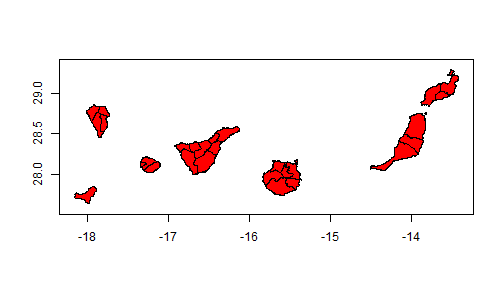
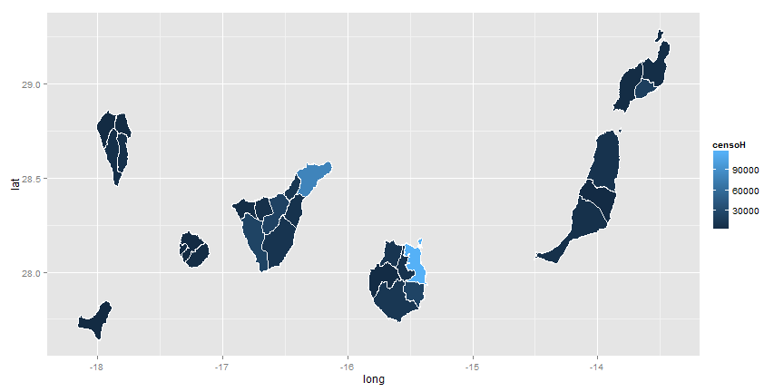
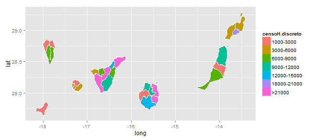

# La librería maptools

1. Esta librería es un conjunto de herramientas para leer y manejar objetos espaciales. 
2. En particular, permite cargar archivos ESRI shapefiles (.shp).
3. Esta librería se suele utilizar en combinación con otras: sp (clases y métodos para datos geo-espaciales), RColorBrewer (paletas de colores) y ggplot2 (libraría gráfica).
<br>
Website (blog): http://rspatialtips.org.uk/
<br>
Tutorial: https://dl.dropbox.com/u/9577903/broomspatial.pdf


---

# Cargar archivos shapefiles (line)

Cargamos los archivos de las 27 comarcas de canarias:


```r
library(maptools)
canary.counties <- readShapeLines(fn = "ISTAC_comarcas27_R.shp")
plot(canary.counties, axes = TRUE, col = "red")
```


 


---

# Cargar archivos shapefiles (poly)

Vamos a cargar el mapa en forma de polígonos (Poly Shape):


```r
canary.counties <- readShapePoly(fn = "ISTAC_comarcas27_R.shp")
plot(canary.counties, axes = TRUE, col = "red")
```


 


---

# Objetos shapefiles

Para examinar el objeto canary.counties que hemos cargado:


```r
canary.counties
summary(canary.counties)

slotNames(canary.counties)
canary.counties@data
canary.counties@polygons[[1]]
```


Observamos que los ejes representados no corresponden a las escalas de latitud y longitud de un mapa:


```r
print(proj4string(canary.counties))
proj4string(canary.counties) <- "+proj=longlat +datum=WGS84"
print(proj4string(canary.counties))
plot(canary.counties, axes = TRUE)
```


---

# El slot "data"

Para representar una variable en un mapa, lo más común es asociar al slot "data" los valores de la variable utilizando el comando merge(). Por ejemplo:


```r
censal.hombres <- data.comarcas.censal[data.comarcas.censal$sexo == "men", ]
canary.tmp <- merge(canary.counties@data, censal.hombres, by.x = "CODCOM", by.y = "comarca", 
    sort = FALSE)
canary.counties@data$sexoH <- canary.tmp$sexo
canary.counties@data$censoH <- canary.tmp$censo
```


Tambien se puede utilizar el comando match(). Por ejemplo:

```r
censal.mujeres <- data.comarcas.censal[data.comarcas.censal$sexo == "women", 
    ]
idx <- match(canary.counties@data$CODCOM, censal.mujeres$comarca)
canary.counties@data$sexoM <- censal.mujeres$sexo[idx]
canary.counties@data$censoM <- censal.mujeres$censo[idx]
```


---

# Mapa de intensidad

Para representar un mapa de intensidad, necesitamos definir una paleta de colores y luego el comando spplot();


```r
library(classInt)
library(RColorBrewer)
n = 7
# obtener una paleta de 7 colores
pal <- brewer.pal(n, "Blues")
# obtener intervalos de clase para 7 colores
int <- classIntervals(canary.counties@data$censoH, n, style = "jenks")

p <- spplot(canary.counties["censoH"], col.regions = pal, at = signif(int$brks, 
    digits = 2), lwd = 0.4, col = "black")
p
```

 


---

# Paletas de colores

La comarca con menor valor del censo se puede quedar de color blanco: 


```r
# corrección del primer color de la escala
int$brks[1] <- 1000
# comprobar el orden de representación
canary.counties@data[order(canary.counties@data$censoH), ]
```


Podemos utilizar otras paletas:


```r
# Paletas

# display.brewer.pal(n, 'Blues')
pie(rep(1, n), col = brewer.pal(n, "Blues"))
pie(rep(1, n), col = brewer.pal(n, "YlOrRd"))
pie(rep(1, n), col = heat.colors(n))
pie(rep(1, n), col = terrain.colors(n))
```


---

# Intervalos de clase


```r
pal <- heat.colors(n)
p <- spplot(canary.counties["censoH"], col.regions = pal, at = signif(int$brks, 
    digits = 2), lwd = 0.4, col = "black")
p
```

 


Se pueden utilizar otros métodos para los intervalos de clase:


```r
# Intervalos de clase
int <- classIntervals(canary.counties@data$censoH, n, style = "quantile")
int <- classIntervals(canary.counties@data$censoH, n, style = "pretty")
int <- classIntervals(canary.counties@data$censoH, n, style = "jenks")
```


---

# Métodos alternativos representación de mapas

Podemos utilizar otros métodos de representación, plot() + legend():


```r
# Representaciones alternativas
plot(canary.counties, col = pal[findInterval(canary.counties@data$censoH, int$brks, 
    all.inside = TRUE)], axes = TRUE)
legend(x = -18, y = 30.5, legend = leglabs(round(int$brks)), cex = 0.9, fill = pal, 
    bty = "n", x.intersp = 0.5)
```

 


---

# Métodos alternativos representación de mapas

Otros métodos de representación, fortify()+ggplot2():
 

```r
# Otra mas
library(ggplot2)

# convertir el objeto 'SpatialPolygons' en data.frame
canary.fort <- fortify(canary.counties, region = "IDCOM27")
head(canary.fort)

canary.fort <- merge(canary.fort, canary.counties@data[, c("IDCOM27", "censoH")], 
    by.x = "id", by.y = "IDCOM27", sort = FALSE)

ggplot(data = canary.fort, aes(long, lat, group = group)) + geom_polygon(colour = "black", 
    fill = "white")
```


---

# Métodos alternativos representación de mapas

Entonces:


 

```r
map <- ggplot(data = canary.fort, aes(long, lat, group = group, fill = censoH)) + 
    geom_polygon() + geom_path(color = "white")
map
```

 


---

# Representaciones en escalas discretas

Otras variantes con ggplot2():


```r
map + scale_fill_gradient(low = "white", high = "black")

map + scale_fill_gradient(name = "censo", breaks = c(10000, 50000, 90000))

map + scale_fill_gradientn(colours = brewer.pal(7, "Blues"), limits = c(1000, 
    1e+05))
```


Podemos utilizar escalas discretas en el gráfico:


```r
canary.fort$censoH.discreto <- cut(canary.fort$censoH, breaks = c(1000, 3000, 
    6000, 9000, 12000, 15000, 18000, 21000, Inf), labels = c("1000-3000", "3000-6000", 
    "6000-9000", "9000-12000", "12000-15000", "15000-18000", "18000-21000", 
    ">21000"), include.lowest = TRUE)

head(canary.fort)
```


---

# Representaciones en escalas discretas

Entonces:


```r
map <- ggplot(data = canary.fort, aes(long, lat, group = group, fill = censoH.discreto)) + 
    geom_polygon() + geom_path(color = "white")

map
```

 

```r
# map + scale_fill_brewer('Censo hombres total')
```


---

# Representaciones en escalas discretas

Podemos representar las comarcas de una isla:


```r
# canary.counties@data[canary.counties@data$CODISLA=='GC',]
idx <- canary.fort$id %in% canary.counties@data[canary.counties@data$CODISLA == 
    "GC", "IDCOM27"]
canary.fort2 <- canary.fort[idx, ]

map <- ggplot(data = canary.fort2, aes(long, lat, group = group, fill = censoH.discreto)) + 
    geom_polygon() + geom_path(color = "white")

map
```

 


---

# Representaciones con gráficos panel

Podemos representar con ggplot:


```r
canary.fort <- merge(canary.fort, canary.counties@data[, c("IDCOM27", "IDPROV", 
    "PROV", "CODISLA", "ISLA")], by.x = "id", by.y = "IDCOM27", sort = FALSE)

idx <- canary.fort$id %in% canary.counties@data[canary.counties@data$PROV == 
    "Santa Cruz de Tenerife", "IDCOM27"]

canary.fort2 <- canary.fort[idx, ]

map <- ggplot(data = canary.fort2, aes(long, lat, group = group, fill = censoH.discreto)) + 
    geom_polygon() + geom_path(color = "white")

map + facet_grid(PROV ~ ISLA, scales = "free_x")
```

 


